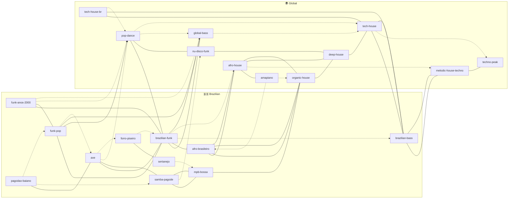

# The genre graph

The single most important idea in NEXTRACK: **genres are nodes in a graph, and
the edges are how you travel between them.** You don't memorize a fixed setlist —
you navigate a map, choosing your next move based on where the room is.

The graph lives in [`../genres/graph.yml`](../genres/graph.yml). This doc explains
how to *read* and *use* it.

## Why a graph and not a list

A list implies order. But you don't play genres in a fixed order — you *fluctuate*
based on the crowd. What you actually need to know in the moment is: **from where
I am now, where can I credibly go next, and how?** That's a graph question. Each
edge answers it with three things:

- **`to`** — a genre you can move to,
- **`via`** — the technique that makes the move work (BPM path, rhythmic bridge,
  harmonic feel),
- **`strength`** — how reliably it lands (`strong` / `medium` / `weak`).

## Fluctuating *within* a node

The track catalog is a **pool**, not a play-order. Inside a single genre node you
have many tracks at various energies and keys. During a set you move *within* the
node freely — picking the next track by reading the room (harder? softer? more
vocal? more percussive?) — and only when you want to *change territory* do you
follow an **edge** to a neighboring node. So:

- **Within a node** → pick by energy + key + crowd (see
  [harmonic-mixing.md](harmonic-mixing.md), [energy-arcs.md](energy-arcs.md)).
- **Between nodes** → follow an edge and use its `via` technique.

## The starting map

Solid = `strong`, dashed = `medium`. (`weak` edges are in `graph.yml` but omitted
here to keep the picture readable.) Some edges — especially into `axe` and
`pop-dance` — are **open-format bridges**: you travel them with a cut, echo out, or
FX, not a blend (see [mixing-styles.md](mixing-styles.md)).



## Reading a journey off the map

A late-night Brazilian arc, for example:

```
organic-house  →  afro-house  →  afro-brasileiro  →  brazilian-funk  →  global-bass
   (warm)          (percussion)     (BR identity)       (peak baile)      (keep it rolling)
```

Every arrow is a real edge with a `via` note in `graph.yml`. Turn an arc like this
into a [radio](../radios/) (a themed program) and slice it into
[blocks](../blocks/) (time-boxed, with energy arcs and — later — light scenes).

## Growing the graph

1. Add or refine a node in [`../genres/graph.yml`](../genres/graph.yml).
2. Add the plain-language entry in [taxonomy.md](taxonomy.md).
3. After a gig, **update edge `strength`** based on what actually worked. The
   graph gets smarter every time you play.
